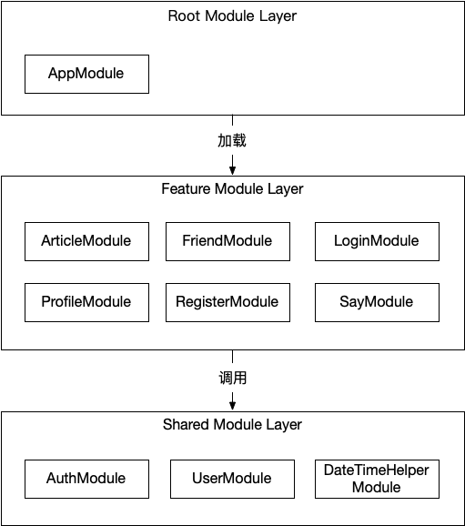

# 探索子博客下一代统一数据与服务后端平台

这是一个技术博客网站的后端。

## 代码目录结构

在 `src` 目录下，存放着程序引导代码、根模块代码、各个功能模块的代码（按目录存放），以及各个公共模块的代码（在 `shared` 目录下按目录存放）：

```
src
├── app.module.ts
├── article
├── friend
├── login
├── main.ts
├── profile
├── register
├── say
└── shared
```

`main.ts` 为应用程序启动入口。`app.module.ts` 为根模块，负责加载各个功能模块，它们是：

- `article` 文章列表模块，负责文章的查询和发布，当前实现了查询功能；
- `friend` 友链管理模块，负责友链管理，具体包括友链查询、申请提交和审批，当前实现了友链查询功能；
- `login` 登录模块，负责实现登录 API;
- `profile` 用户资料模块，负责实现用户资料查询 API;
- `register` 用户注册模块，负责实现用户注册 API;
- `say` 说说模块，负责说说的创建和查询；

`src/shared` 目录下存放着全部共用模块：

```
src/shared
├── auth
├── date-time-helper
└── user
```

其中：

- `auth` 模块提供身份验证服务，实现 passport 框架下的策略；
- `date-time-helper` 模块提供日期字符串处理服务；
- `user` 模块提供用户管理服务；

## 模块之间的依赖关系设计

根模块加载各个功能模块，各个功能模块互相之间不依赖，根模块不实现具体的功能，功能模块可以调用共用模块。



当前架构暂且类似上图所示，并且会在未来不断进行变更和改进以灵活适应不同的开发阶段和业务逻辑。

